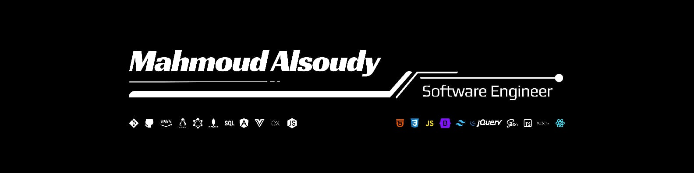

<h1 align="center">
I'm Mahmoud Alsoudy
</h1>

<h3 align="center">
🚀 Full Stack Developer | Backend Engineer | DevOps Enthusiast
</h3>

<!--  -->

  

# 💫 About Me

I'm a passionate Full Stack Developer from Egypt 🇪🇬

I enjoy building scalable web applications, designing clean architectures, deploying production-ready systems, and solving real-world problems.

Currently focusing on:

- ⚡ Backend Development
- ☁️ DevOps & Cloud
- 🐳 Docker
- 🚀 CI/CD
- 🤖 AI Integration
- 🔐 Cybersecurity

I believe great software isn't just about writing code—it's about creating reliable systems that users love.

 

# 🚀 Tech Stack

  

<!-- # 📊 GitHub Stats

-->
 

# 🚀 Project Skills

- 🏗️ Architected and developed scalable full-stack applications with clean, maintainable, and production-ready architectures.
- ⚡ Built secure, high-performance RESTful APIs with authentication, authorization, RBAC, and optimized database operations.
- 🤖 Integrated AI-powered solutions including Agentic RAG, intelligent chatbots, prediction models, and computer vision features.
- 🗄️ Designed scalable PostgreSQL and MongoDB databases with efficient schemas, indexing, multi-tenancy, and data optimization.
- ☁️ Deployed, configured, and maintained cloud-based applications on AWS, DigitalOcean, Hostinger VPS, and Vercel.
- 🐳 Automated development and deployment workflows using Docker, GitHub Actions, CI/CD pipelines, Nginx, Linux, and PM2.
- 📊 Delivered complete business solutions including SaaS platforms, POS systems, LMS platforms, e-commerce applications, and management dashboards.
- 🔐 Applied modern security practices including JWT authentication, input validation, OWASP principles, tenant isolation, and secure API design.
- 🚀 Optimized application scalability, reliability, and performance through caching, modular architecture, and continuous system improvements.
- 🤝 Collaborated throughout the software lifecycle, transforming business requirements into reliable, user-focused, and production-ready solutions. 

 

# 🔥 GitHub Streak

 

# 📈 Contribution Graph

 

# 🌎 Connect With Me

&nbsp&nbsp&nbsp&nbsp
&nbsp&nbsp&nbsp&nbsp

 

---

 

 

> "First, solve the problem. Then, write the code."

 

<h1 align="center">
⭐ Thanks for visiting my profile!
</h1>
